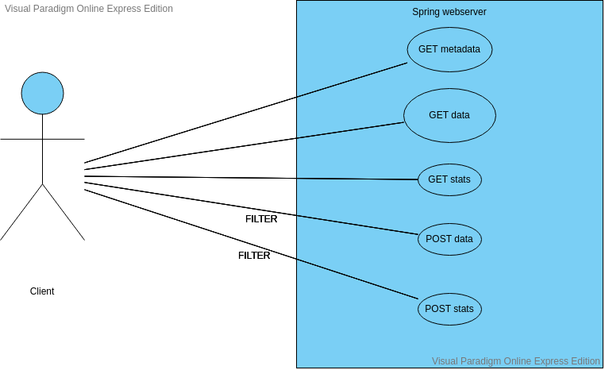
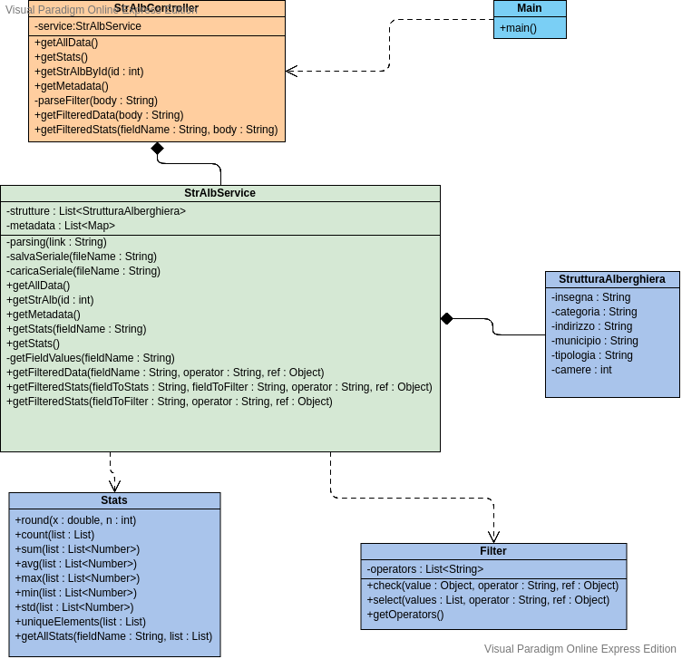
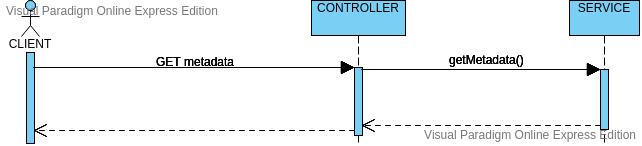
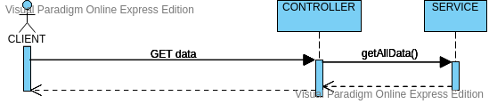
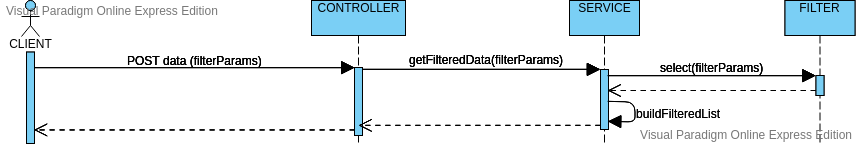
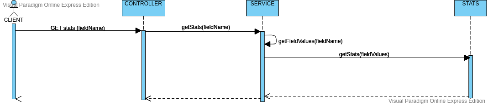
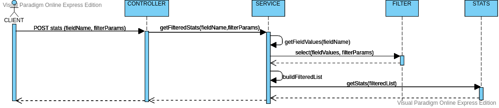

# Progetto d'esame - Programmazione ad Oggetti
Progetto d'esame per il corso di **Programmazione ad Oggetti**.
Ingegneria Informatica e dell’Automazione (Università Politecnica delle Marche).
Realizzato da **Lanciotti Antonio** e **Pelivani Arment**.

## Introduzione
Il progetto consiste in un'applicazione Java basata sul framework Spring che restituisce tramite API REST GET o POST dati e statistiche in formato JSON a partire da un [dataset](http://dati.lazio.it/catalog/dataset/310fc617-37a6-4ad2-bcab-25bf69512693/resource/3adcd1dc-9461-4475-8377-e1f3ba041d81/download/romacapitaleelencoesercizialberghiericomunediroma5stelle.csv) assegnatoci in formato csv.
Il progetto può essere compilato attraverso i framework Maven e Gradle che gestiscono l'importazione delle librerie Spring.

## Come utilizzare il software

Il software avvia un web-server in locale sulla porta 8080 che rimane in attesa di richieste effettuate da client.
All'avvio il software effettua il parsing del csv oppure ricarica, se presente, il dataset da file cache "dataset.ser" in formato Serial di Java creato in una sessione precedente dal software stesso.

### Richieste gestite
Il software gestisce tre tipi di richieste:
- Restituisce i metadata del dataset
- Restituisce i dati (eventualmente filtrati)
- Restituisce statistiche sui dati (eventualmente filtrati)

#### Metadati
Rotta: `/metadata`
Tipo richiesta: GET
Restituisce la lista di metadati in formato JSON.

#### Dati
Rotta: `/data`
Tipo richiesta: GET o POST
- GET restituisce l'intero dataset in formato JSON; è possibile inoltre richiedere un singolo record del dataset aggiungendo l'id alla rotta tramite path variable: `/data/{id}`.
 Es:
 -- `GET /data`
-- `GET /data/5`
- POST restituisce il dataset filtrato sulla base dei parametri inseriti nel body della richiesta; per la sintassi del filtro leggere più avanti.

#### Statistiche
Rotta: `/stats`
Tipo richiesta: GET o POST
- GET restituisce le statistiche in formato JSON per il campo passato come parametro "field" alla richiesta; è possibile omettere il parametro per ottenere la lista delle statistiche di tutti i campi.
Es:
-- `GET /stats?field=camere`
-- `GET /stats`
- POST restituisce le statistiche considerando solo i record che soddisfano il filtro specificato nel body della richiesta; per la sintassi del filtro leggere più avanti.
Anche in questo caso si può specificare un campo oppure omettere il parametro come nel caso della GET.

## Sintassi filtro

Il filtro va inserito nel body della richiesta POST come stringa RAW e deve avere il seguente formato:

    {"field" : {"operator" : refvalue}}

Non è possibile applicare più filtri contemporanemente.
### Field
Specifica il campo sul quale deve essere applicato il filtro.
I campi validi sono specificati nei metadati e il tipo di dato da usare come riferimento deve essere lo stesso del campo.

### Operator
L'operatore che specifica il tipo di filtro richiesto.
| Operatore | Descrizione                             | Valore di riferimento                       |
|-----------|-----------------------------------------|---------------------------------------------|
| `$eq`       | uguaglianza                             | Dello stesso tipo del campo                         |
| `$not`      | disuguaglianza                          | Dello stesso tipo del campo                         |
| `$in`       | appartenenza a insieme (whitelist)      | Lista di valori dello stesso tipo del campo |
| `$nin`      | non appartenenza a insieme (blacklist)  | Lista di valori dello stesso tipo del campo |
| `$gt`       | maggiore (solo per campi numerici)      | Numero                                      |
| `$gte`      | maggiore o uguale (solo per campi num.) | Numero                                      |
| `$lt`       | minore (solo per campi numerici)        | Numero                                      |
| `$lte`      | minore o uguale (solo per campi num.)   | Numero                                      |
| `$bt`       | compreso (solo per campi num.)          | Lista di due numeri                         |
Se si vuole utilizzare l'operatore `$eq`si può usare un formato più compatto per il filtro, ovvero:

    {"field":refvalue} ≡ {"field":{"$eq":refvalue}}

### Refvalue
 Valore di riferimento per il controllo, vedi tabella precedente.
 Segue la sintassi JSON.

### Esempi
- Strutture con almeno 20 camere:   `{"camere" : {"$gt" : 20}}`
- Strutture situate nel municipio I di Roma `{"municipio" : "I"}`
- Strutture con un numero di camere compreso tra 40 e 50: `{"camere":{"$bt":[40,50]}}`

## Struttura progetto Java
Il progetto presenta un package principale `com.lancarm.javaoop`che contiene tutti i sorgenti delle classi Java. Le classi sono divise in tre package:
- `model`: contiene la classe `StrutturaAlberghiera`che modella il singolo record del dataset;
- `service`: contiene la classe `StrAlbService` che carica e gestisce gli accessi al dataset, e le classi `Stats`e `Filter`di utilità;
- `controller`: contiene la classe `StrAlbController`che gestisce le richieste del client e converte le risposte da oggetti Java a stringhe in formato JSON.

Per la documentazione delle classi con i vari metodi spiegati nel dettaglio fare riferimento al JavaDoc.
Di seguito i diagrammi UML dei casi d'uso, delle classi e delle sequenze che mostrano la struttura del progetto e le modalità di funzionamento di esso.

### Diagramma dei casi d'uso

### Diagramma delle classi

### Diagrammi delle sequenze
#### GET metadata

#### GET data

#### POST data

#### GET stats

#### POST stats

